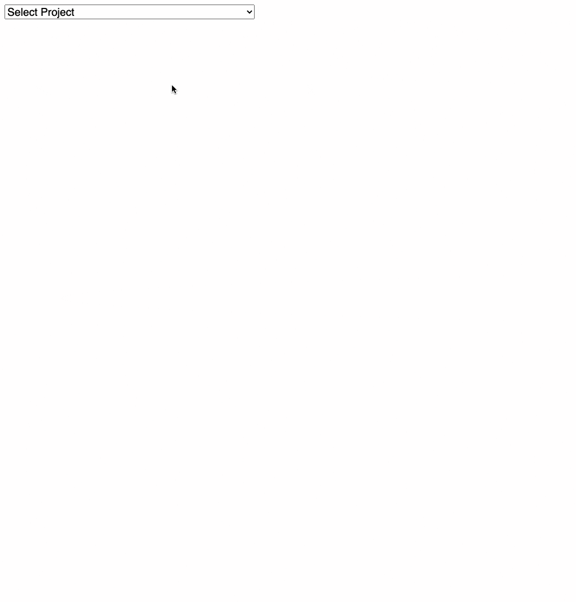

# Graph

This is a web application that shows you the relationships between various resources deployed in an OpenShift project.

It uses the Kubernetes Go client in the backend, and [D3.js](https://d3js.org) and [Vue.js](https://vuejs.org) in the frontend.

## Installation

To install this on OpenShift,

1. Edit `Makefile` and set the `PROJECT` variable to the namespace you want to this deploy to

1. Login as an administrator using the `oc` CLI

1. Run `make deploy`

## Todo

1. details screen

1. `configmaps` and `secrets` used in the `environment` in pod containers

1. `StatefulSets` and `DaemonSets`

## Resources

* [Unstructured docs](https://pkg.go.dev/k8s.io/apimachinery/pkg/apis/meta/v1/unstructured#Unstructured)